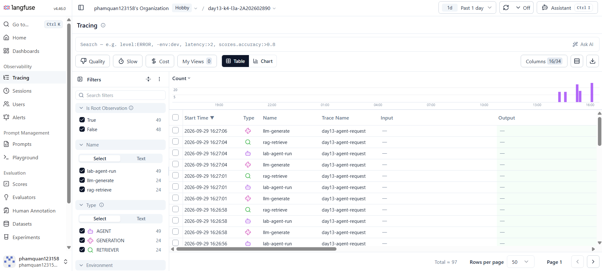
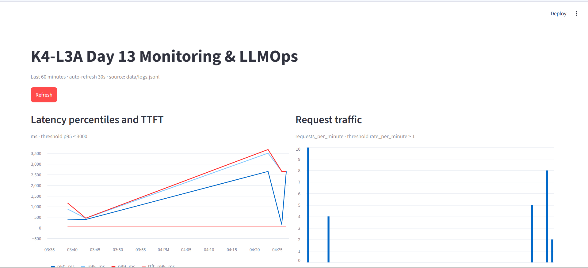

# Báo cáo cá nhân — K4-L3A Day 13 Monitoring & LLMOps

> Mỗi học viên hoàn thiện một file duy nhất này. Khi dẫn evidence, dùng đường dẫn tương đối, ví dụ `evidence/07-trace-waterfall.png`.

## 1. Thông tin học viên

- **Họ và tên:** Phạm Quân
- **MSSV:** 2A202602890
- **Lớp:** K4-L3A
- **Repository URL:** https://github.com/phamquan123158/K4-L3-Day13-PhamQuan-2A202602890-Monitoring-LLMOps
- **Commit SHA cuối:** `31f006f180f4a6d9771ba1477e1e4c7dc3c9f081`
- **Challenge ID:** `day13-k4-l3a-monitoring-llmops-v1`
- **Tên project Langfuse cá nhân:** `day13-k4-l3a-2A202602890`

## 2. Evidence index

Điền đúng đường dẫn tới evidence thực tế. Có thể đổi tên hoặc dùng nhiều ảnh nếu cần.

| Evidence | Đường dẫn |
|---|---|
| Pytest cuối | `evidence/01-pytest.txt` |
| Log validator | `evidence/02-log-validator.txt` |
| Dashboard validator | `evidence/03-dashboard-validator.txt` |
| Structured log | `evidence/04-structured-log.txt` |
| PII redaction | `evidence/05-pii-redaction.txt` |
| Trace list | `evidence/06-trace-list.txt` |
| Trace waterfall | `evidence/07-trace-waterfall.txt` |
| Trace metadata | `evidence/08-trace-metadata.txt` |
| Prompt versions | `evidence/09-prompt-versions.txt` |
| Prompt rollback | `evidence/10-prompt-rollback.txt` |
| Langfuse UI screenshot | `evidence/langfuse.png` |
| Dashboard runtime | `evidence/11-dashboard-overview.png` |
| Incident metric | `evidence/12-incident-metric.txt` |
| Incident log | `evidence/13-incident-log.txt` |
| Incident trace | `evidence/14-incident-trace.txt` |

## 3. Kết quả kỹ thuật

| Nội dung | Baseline | Kết quả cuối | Nhận xét |
|---|---|---|---|
| `validate_logs.py` | 30/100 | 100/100 | 0 trường bắt buộc/enrichment thiếu; 0 PII leak |
| `validate_dashboard.py` | | 6/6 panel | Contract hợp lệ và dashboard runtime đã render đủ panel |
| `pytest` | | 23 passed | Chạy trong `.venv` |
| Số traces hợp lệ | | 24 | Langfuse v2 xác nhận đủ AGENT/RETRIEVER/GENERATION trong cửa sổ 60 phút |
| Số PII leak | | 0 | Log validator trên 85 record hiện có |
| Latency P95 / TTFT P95 | | 2654 ms / 50 ms | CP3 challenge, 5 request; baseline cùng process 1218 ms |
| Retrieval success rate | | 100% | Cả 5 request challenge đều retrieval thành công |

## 4. Logging và PII

- **Cách tạo/nhận và truyền correlation ID:** middleware chấp nhận `x-request-id` hợp lệ dạng `req-<8-hex>`, nếu thiếu/sai format thì tự sinh; ID được bind vào structlog contextvars, response header và trace metadata.
- **Các metadata được ghi vào structured log:** `user_id_hash`, `session_id`, `feature`, `model`, `env`.
- **Cách bảo đảm PII được scrub trước khi ghi:** processor scrub đệ quy event trước JSON renderer và file writer; không bật capture input/output thô cho observations.
- **Cách kiểm chứng kết quả:** `validate_logs.py` đạt 100/100, không có PII phát hiện trong 85 log hiện có.

## 5. Tracing và prompt versioning

- **Cách xác nhận traces do chính tôi tạo trong project cá nhân:** dùng project `day13-k4-l3a-2A202602890` đã cấu hình trong `.env`; Langfuse v2 xác nhận 24 trace đủ root/retriever/generation trong 60 phút gần nhất.
- **Cấu trúc root/retrieval/generation observations:** root `lab-agent-run` (`AGENT`) có hai child `rag-retrieve` (`RETRIEVER`) và `llm-generate` (`GENERATION`).
- **Cách nối trace với log:** cùng `correlation_id` trong metadata trace và JSONL; ví dụ `req-24a4af97`.
- **Prompt name:** `day13-chat`.
- **Version/label baseline:** version 1, label `baseline`.
- **Version/label candidate:** version 2, label `candidate`.
- **Trace ID của mỗi version:** baseline v1 `da83975537b21709b9a639954ffe7a49`; candidate v2 `bf7c40d30d813e9ed84914bf0c1d3434`; production v2 trước rollback `5ffa3847347ef03d41d0850602635b76`; production v1 sau rollback `adf01943995b07d8af837cfa2460e30e`.
- **Cách promote và rollback `production`:** production được gán v2, cùng input sinh trace trên, sau đó label được trả về v1; Langfuse v2 xác nhận production hiện là version 1 (`baseline`, `production`).

## 6. Dashboard, SLO và alerts

- **Dashboard và sáu panel:** Streamlit đọc `data/logs.jsonl`, cửa sổ 60 phút, refresh 30 giây; latency/TTFT, traffic, errors/retrieval success, cost, tokens, quality. Contract validator đạt 6/6.
- **SLO và lý do chọn:** `fast_successful_requests` mục tiêu 99.5% trong 28 ngày; request thành công khi có `response_sent` và latency không quá 3000 ms. Ngưỡng bắt suy giảm trước khi request trở nên quá chậm với người dùng.
- **Cách tính error budget:** 100% - 99.5% = 0.5% tổng request trong cửa sổ 28 ngày; số request lỗi cho phép = tổng request × 0.005 (ví dụ 10,000 request tương ứng 50 request).
- **Ba alert và runbook tương ứng:** `p95_latency_degradation` → [Alert 1](../docs/alerts.md#alert-1); `retrieval_failure_spike` → [Alert 2](../docs/alerts.md#alert-2); `quality_and_cost_regression` → [Alert 3](../docs/alerts.md#alert-3). Cả ba gửi Slack và có severity, duration, owner.

## 7. Điều tra challenge

- **Challenge ID:** `day13-k4-l3a-monitoring-llmops-v1` (K4).
- **Khoảng thời gian điều tra:** 2026-09-29 09:26:53–09:27:07 UTC; incident được bật/tắt qua endpoint và tắt trong `finally` sau workload.
- **Triệu chứng từ metrics:** baseline P95 1218 ms; challenge P95 2654 ms, vượt challenge threshold 2000 ms; TTFT P95 giữ ở 50 ms. Năm request challenge đều trả 200.
- **Log line và correlation ID liên quan:** `2026-09-29T09:26:53.589991Z`, `request_received`, feature `monitoring`, correlation ID `req-0e0c46fc`; `response_sent` lúc `09:26:56.246045Z`, latency 2654 ms, retrieval success.
- **Trace ID và span gây ảnh hưởng:** trace `b4c9ca13605c491ea915ed72a7c40f57` có correlation ID `req-0e0c46fc`; `rag-retrieve` mất 2.502 s, so với `llm-generate` 0.153 s.
- **Root cause:** challenge bật `rag_slow`, làm `retrieve()` thêm độ trễ 2.5 s. Retrieval thành công nhưng chi phối tổng latency; TTFT không tăng.
- **Fix action:** tắt incident sau workload; xác nhận `/health` trả trạng thái `rag_slow=false` và các incident khác cũng false.
- **Preventive measure:** đặt alert early-warning P95 > 2000 ms trong 5 phút, dưới SLO latency 3000 ms; theo dõi retrieval span và đặt deadline/cache hoặc fallback cho retrieval để giới hạn thời gian chờ.

Evidence text đã lưu: [metric](evidence/12-incident-metric.txt), [log](evidence/13-incident-log.txt), [trace](evidence/14-incident-trace.txt).

## 8. Giải thích và tự đánh giá

- **Một quyết định kỹ thuật quan trọng và lý do:** dùng P95 2000 ms làm early-warning riêng, trong khi SLO giữ latency 3000 ms, để phát hiện suy giảm trước khi chạm ngưỡng SLO.
- **Một lỗi/blocker đã gặp:** API cũ trên cổng 8000 chỉ phát root observations, không có waterfall retrieval/generation.
- **Cách tìm nguyên nhân và xử lý:** truy vấn Langfuse observations v2 theo trace ID; xác nhận process cũ thiếu child spans, rồi chạy challenge trên source hiện tại và nối log/trace bằng correlation ID.
- **Cách hiểu luồng Metrics → Logs → Traces:** P95 xác định khoảng suy giảm; `req-0e0c46fc` định vị log bị ảnh hưởng; trace cho thấy retrieval mất 2.502 s trong khi generation chỉ mất 0.153 s.
- **Vai trò của prompt version, token/cost, SLO hoặc rollback trong vận hành LLM:** version và label cho phép truy lại/rollback prompt; token/cost kiểm soát chi phí; SLO và early-warning phân biệt mức dịch vụ mục tiêu với suy giảm cần điều tra.
- **Điều quan trọng nhất đã học:** chỉ kết luận root cause khi metric, log correlation ID và thời lượng span cùng xác nhận một bước xử lý.
- **Hạn chế hoặc phần chưa hoàn thành, nếu có:** screenshot Langfuse đã được thêm và nhúng trong report; xác nhận ảnh không lộ API key và bổ sung ảnh riêng cho waterfall/prompt rollback nếu screenshot hiện tại chưa bao quát. SHA trong mục 1 là HEAD đã xác minh trước cập nhật report này; hãy commit thay đổi report và dùng SHA mới trên LMS.

## 9. Checklist trước khi nộp

- [ ] Kết quả và evidence thuộc commit SHA cuối.
- [ ] Tất cả ảnh/output mở được bằng đường dẫn tương đối.
- [x] Incident evidence nối đúng metric → log → trace.
- [ ] Trace/prompt evidence thuộc project Langfuse cá nhân và ảnh không lộ key/secret.
- [x] Repository chạy lại được theo README.
- [x] Không có secret, API key, PII thô hoặc evidence của người khác/lớp khác.
- [ ] URL repo và commit SHA cuối đã được nộp trên LMS/Codelabs.
